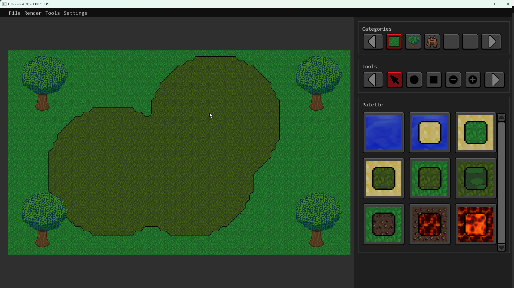
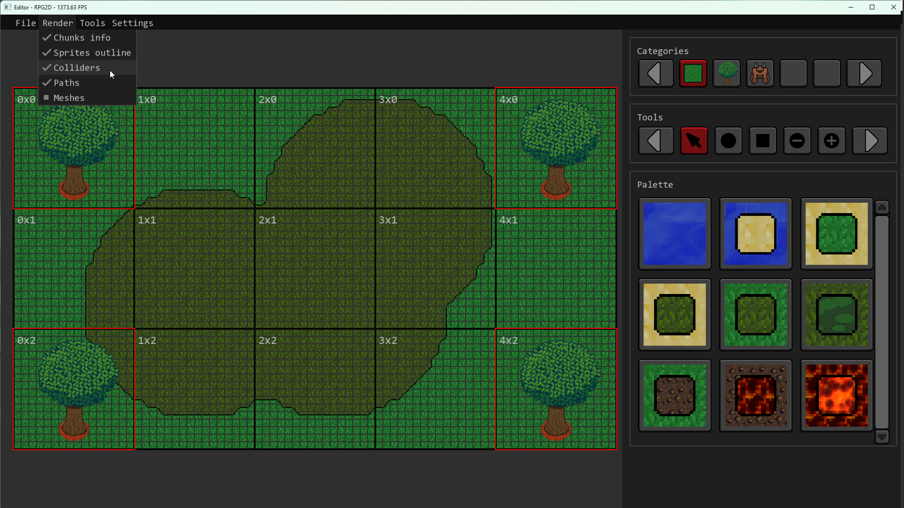
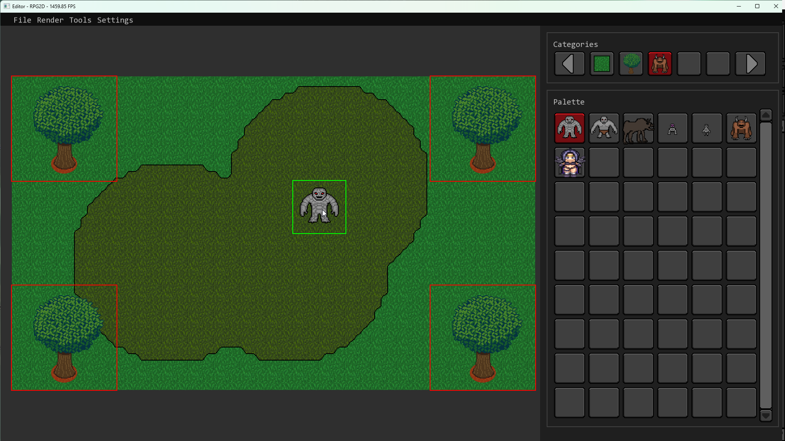
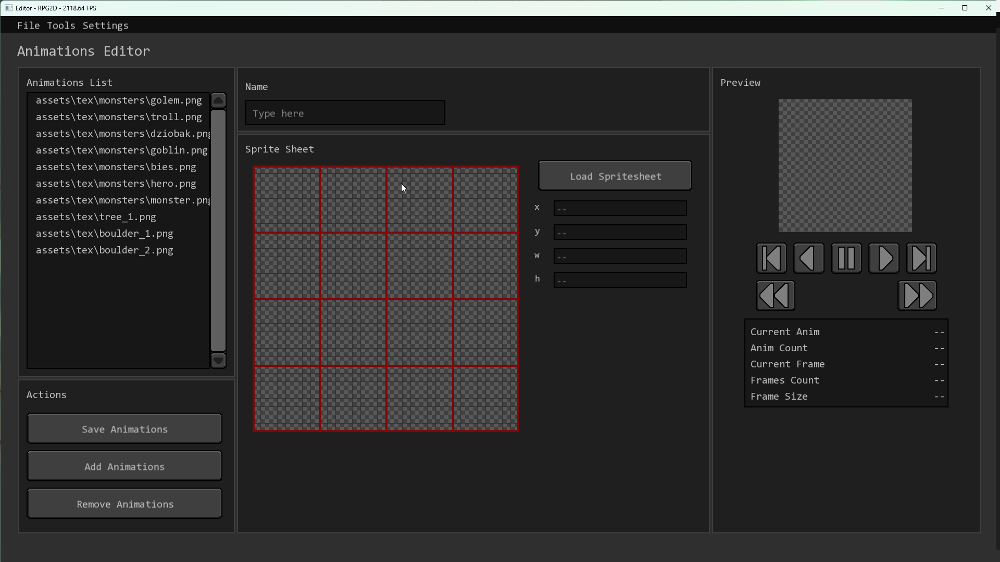
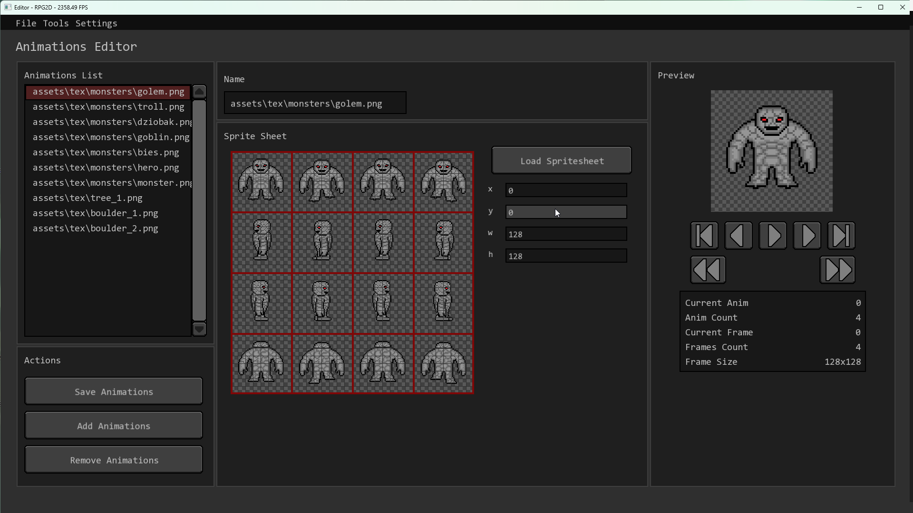
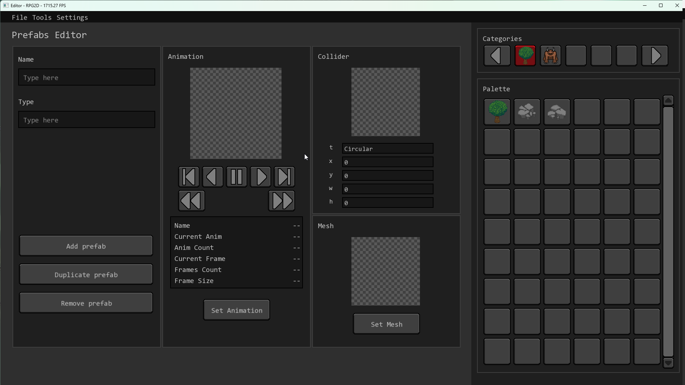
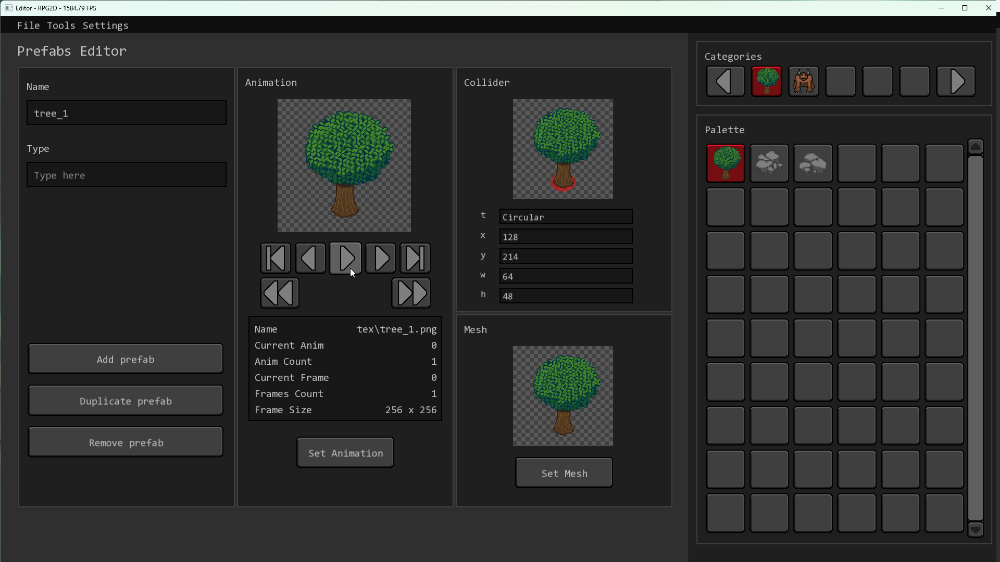

# Editor-RPG2D v0.04

## Contents
- [Description](#description)
- [Screenshots](#screenshots)
- [Installation](#installation)
- [Technology](#technology)
- [License](#license)

## Description
**Editor-RPG2D** is simple program to create games RPG 2D.

## Screenshots

## Installation
1. Download and install Visual Studio 2022
2. Download and install CMake
3. Download Library SFML-3.0.2 (https://www.sfml-dev.org/) and place it in `C:\SFML-3.0.2`.
4. Open The **Command Prompt (cmd)**.
5. Go to project directory:
`
cd ..\..\Editor-RPG2D
`
6. Create directory **build**:
`
mkdir build
`
7. Go to directory **build**:
`
cd build
`
8. Create project using **CMake**:
`
cmake ..
`
9. Build project:
`
cmake --build .
`

11. Set the Working Directory 
`Project -> Properties -> Debugging -> Working Directory -> "$(ProjectDir)/../Editor-RPG2D"`

12. Exe is in **build/Debug** lub **build/Release**

## Techonology
Program created in C++ with using SFML 3.0.2.  
  
## License
Open License – Attribution

This program may be:
- Downloaded
- Copied
- Modified
- Used in personal and commercial projects

Provided that:
- Attribution to the original author is retained
- The source (link to the repository) is provided
- In the event of modification, it must be clearly stated that the program was modified and by whom.